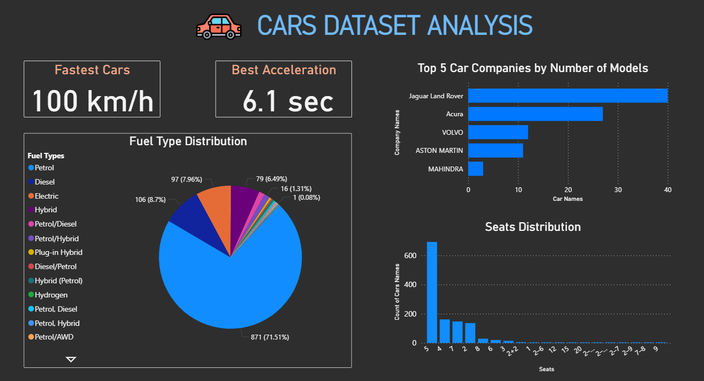

# Cars Dataset Analysis Report

# 📌 Project Overview

This project explores a Cars Dataset using Power BI.
The dashboard highlights key performance metrics, company insights, and distribution patterns to provide a comprehensive view of the dataset.

The report focuses on answering questions like:
Which cars are the fastest and have the best acceleration?
What is the distribution of fuel types across cars?
How are cars distributed based on the number of seats?
Which are the top companies by the number of car models?

# 🛠️ Tools & Technologies

Power BI Desktop – for data cleaning, modeling, and visualization.
Dataset – Cars data (CSV format).

# 📊 Dashboard Features

The dashboard includes the following visuals:
1. Fastest Cars (Card) : Displays the car with the maximum horsepower.
2. Best Acceleration (Card) : Highlights the car with the lowest acceleration time.
3. Fuel Type Distribution (Pie Chart) : Shows percentage split of cars by fuel type (Petrol, Diesel, Electric, etc.).
4. Seats Distribution (Bar Chart) : Compares how many car models belong to each seating capacity.
5. Top 5 Car Companies by Models (Bar Chart) : Identifies companies with the highest number of car models.

# 🖼️ Dashboard Preview

  

# 👩‍💻 Author

Marsha Sharma
📧 marshasharma2004@gmail.com / (marsha_sharmacse2023@msit.edu.in)

# 🔗 Connect with Me  
[🌐 LinkedIn](https://www.linkedin.com/in/marsha-sharma-8b99b42b5/) | [💻 GitHub](https://github.com/04Marsha)
